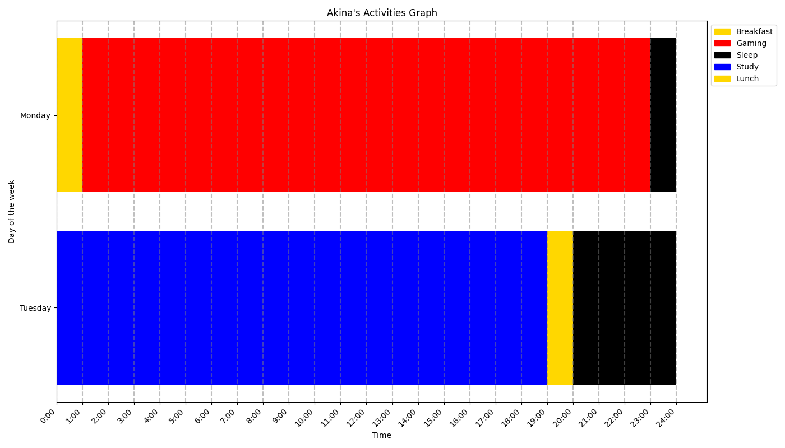
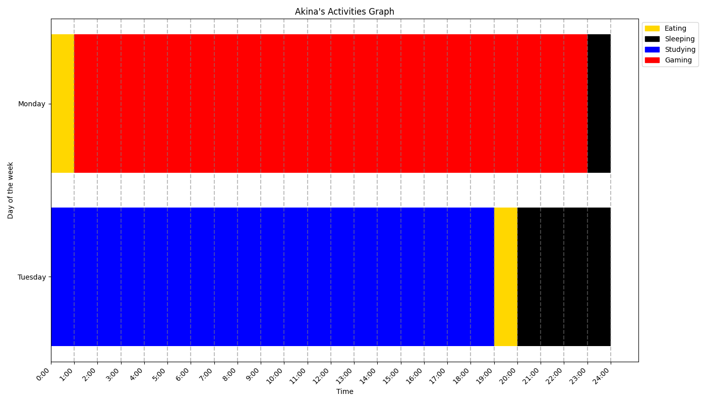

# Agenda Grapher

A project I made to graph my daily activities and even more graphs to get information from them.

I have already added a bunch of graphs already but feel free to make your own graphs and commit them to the project!


## Features

- Everything is highly customisable, you can pick your own colours and give it your own personal touch.
- Line Charts with a day-to-day overview.
- Productivity line chart to graph total productivity
- Comparison charts to compare 2 activities or activity groups with eachother and also graph their ratio.
- More coming soon

## Installation

Install Agenda Grapher with pip

```bash
  pip install -r requirements.txt
```
    
## Demo

There is a file called example_data.py, rename it to data.py to use it! It is mostly there to showcase the input format.


The following are generated using the example_data.py file for privacy reasons:






## Roadmap

- Migrate data.py file to MongoDB

- Make Front-End interface using Django

## Author

- [@Akina](https://www.github.com/kaajjaak)

